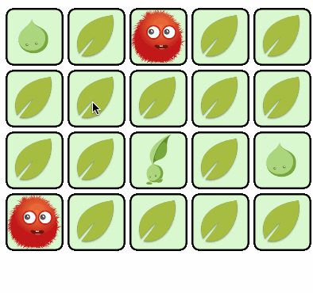

# Memory Game

## Goal

Create a memory game, where you search for two identical symbols.

## Minimum Requirements

 - When the game starts the tiles are faced down;
 - Player can flip over two tiles, if they have the same image, they remain face up. Otherwise they flip back after a short period of time;
 - Game is won when all the tiles are face up.
 
## Bonus

 - Add animations to your game;
 - Count moves and save score for each game, show all the historical scores;
 - Handle page refresh - game and scores should remain the same.
